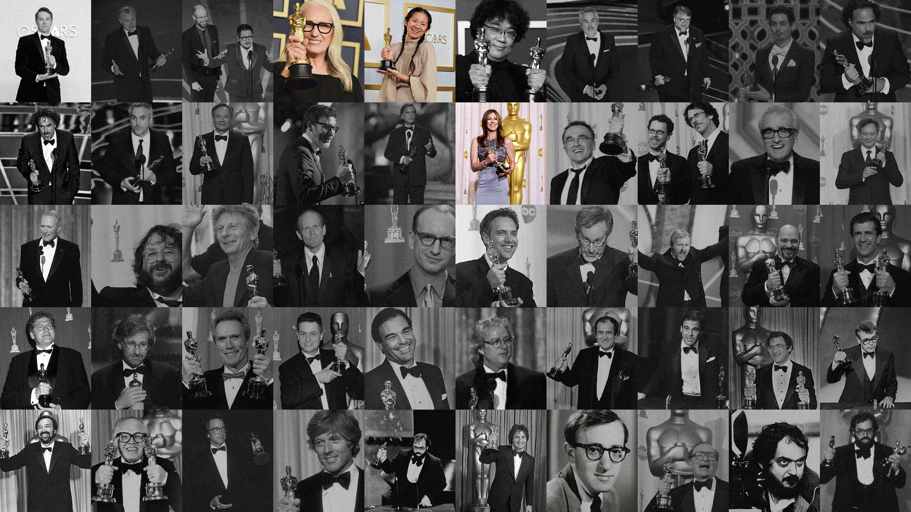

# It Took Almost a Century to See Them on the Stage

A scroll-driven data story on gender inequality in the Academy Awards' **Best Director** category,
1928 to 2025.



**[View it live →](https://letstahl.github.io/oscars-best-director-gender-gap/)**

## What it is

A single-page, scroll-driven story built with vanilla JS and D3.js:

- Two guess-the-number interactions (how many nominations women received, how many actually
  won), each revealing the real count right after.
- A pinned, scroll-triggered line chart of Best Director nominees per year, with a click-to-trace
  interaction on any woman's dot to follow her full nomination history.
- An interactive pictogram database of all 484 Best Director nominees and winners since 1928,
  with filters and portrait tooltips.

## Process

- **Data**: sourced from Kaggle, filtered to the Best Director category, and enriched with
  Wikipedia portrait URLs for the hover tooltips. See `data/NOTES.md` for the full transformation
  and a data quality issue found and fixed along the way.
- **Design**: the whole story was prototyped in Figma first, including the cover image and the
  SVG illustrations, before being brought into code.

## Stack

- HTML, CSS, vanilla JavaScript
- [D3.js](https://d3js.org/) v7 for the chart and pictogram
- [Figma](https://figma.com/) for prototyping and visual design (cover, SVG illustrations)
- No build step: static site, deployable as-is (e.g. GitHub Pages)

## Data

- `data/raw/`: the original, unmodified Kaggle dataset.
- `data/processed/`: the filtered and enriched dataset actually used by the site.
- `data/NOTES.md`: documents exactly how the processed file was derived from the raw one, plus
  any known data issues found along the way.

Sources are also cited in full in the site's footer.

## Running locally

Static site, no dependencies. Serve the folder with any static server, e.g.:

```
npx serve .
```

(Opening `index.html` directly via `file://` will fail to load the CSV due to browser CORS
restrictions on local file fetches.)

## Status

The dataset covers the 1st through the 97th Academy Awards, 1928 to 2025. See `data/NOTES.md`
for details.

## License

[MIT](LICENSE)

If you use this as a reference, a credit is appreciated:

[](https://github.com/letstahl/oscars-best-director-gender-gap)
